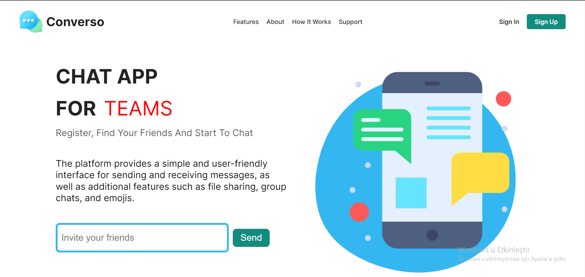

# Chat App 🤙

## Table of contents

- [Summary](#summary)
- [Screenshot](#screenshot)
- [Link](#link)
- [Built with](#built-with)
- [Utility Links](#utility-links)

## Summary

> **I've created a chat application. Users can find their friends and they can send text messages each other after signing up the app. All chat process works synchronously thanks to the SnapShot method of Firestore.**

- I have worked with HTML, SCSS, JavaScript, React.js and Firebase to create this good-looking fully-responsive interactive page 🎯.
- I've used the advantages of React.js to manipulate the DOM efficiently 🎢.
- I like working with Firestore to handle database operations, the structure of firestore helps us to manipulate data, especially making read process is easy thanks to the collection logic 🤝.
- Also love to use firebase-auth for authentication process. I am thankful to Firebase for providing us the social media auth, I really enjoy to use Google auth in my project 🛡.
- In CSS process, I've used SCSS and SCSS helps me to control all color variables and breakpoints for responsive design in one place. Thanks to nested structure of SCSS, I wrote less code in main parts 🌌.
  > **What's next?**
- Images and voices can be sent as a message.
- Also, users can translate the text message to the voice.
- And, I just want to integrate chatGPT api and this will take the project to the next level 🔥.

## Link

<a href="https://converso-app.vercel.app/">Live Version of the project</a>

## Screenshot

## Built with

- HTML
- CSS
- JavaScript
- React.js
- Firebase

## Utility Links

> [JavaScript](https://developer.mozilla.org/en-US/docs/Web/JavaScript)  
> [React.js](https://beta.reactjs.org/)  
> [Firebase](https://firebase.google.com/docs/build?hl=en)  
> [AOS animate](https://github.com/michalsnik/aos)

 Keep Building 🚀

